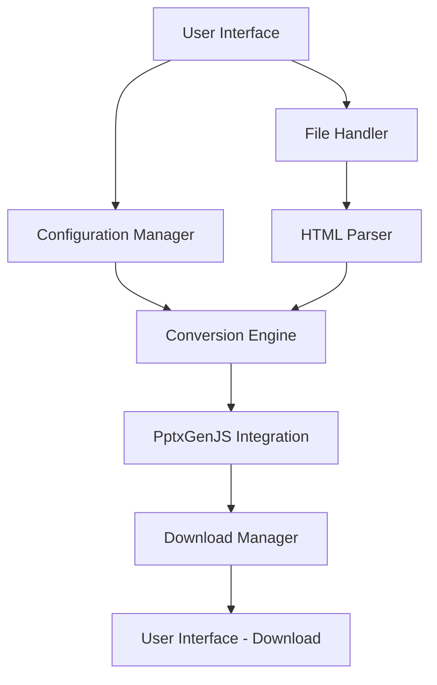

# Design Document: HTML to PPTX Converter

## Overview

This document outlines the design for an HTML to PPTX converter application that allows users to upload HTML content, convert it to PowerPoint presentations using the PptxGenJS library, and download the resulting PPTX file. The application will be built using TypeScript to align with the PptxGenJS library and provide type safety throughout the development process.

## Architecture

The application will follow a client-side architecture with the following components:



### Key Components

1. **User Interface Layer**: Handles user interactions, file uploads, configuration inputs, and download actions
2. **Application Logic Layer**: Contains the HTML parser, conversion engine, and configuration manager
3. **Integration Layer**: Interfaces with the PptxGenJS library
4. **Output Layer**: Manages the generation and download of PPTX files

## Components and Interfaces

### 1. User Interface Component

Responsible for the visual presentation and user interactions.

#### Interfaces:

```typescript
interface UIState {
  isUploading: boolean;
  isConverting: boolean;
  isDownloading: boolean;
  errorMessage: string | null;
  htmlPreview: string | null;
  conversionConfig: ConversionConfig;
}

interface UIActions {
  uploadHTML(file: File): Promise<void>;
  setHtmlContent(content: string): void;
  updateConfig(config: Partial<ConversionConfig>): void;
  startConversion(): Promise<void>;
  downloadPPTX(): void;
}
```

### 2. File Handler Component

Manages file uploads and validates HTML content.

#### Interfaces:

```typescript
interface FileHandler {
  validateHTML(content: string): boolean;
  parseHTMLFile(file: File): Promise<string>;
  getFileSize(file: File): number;
  isFileSizeValid(file: File, maxSizeInMB: number): boolean;
}
```

### 3. Configuration Manager Component

Handles conversion configuration settings.

#### Interfaces:

```typescript
interface ConversionConfig {
  slideLayout: SlideLayout;
  includeImages: boolean;
  theme: PresentationTheme;
  splitSections: SplitStrategy;
  preserveLinks: boolean;
  customStyles: Record<string, any>;
}

enum SlideLayout {
  STANDARD,
  WIDE,
  CUSTOM
}

enum PresentationTheme {
  DEFAULT,
  PROFESSIONAL,
  CREATIVE,
  MINIMAL
}

enum SplitStrategy {
  BY_H1,
  BY_H2,
  BY_CUSTOM_SELECTOR,
  NO_SPLIT
}
```

### 4. HTML Parser Component

Parses and processes HTML content for conversion.

#### Interfaces:

```typescript
interface HTMLParser {
  parseContent(html: string): DocumentFragment;
  extractSections(document: DocumentFragment, strategy: SplitStrategy, customSelector?: string): Section[];
  extractImages(document: DocumentFragment): ImageResource[];
  extractLinks(document: DocumentFragment): LinkResource[];
  extractTables(document: DocumentFragment): TableResource[];
  extractLists(document: DocumentFragment): ListResource[];
}

interface Section {
  title: string;
  content: string;
  elements: SlideElement[];
}

interface SlideElement {
  type: 'text' | 'image' | 'table' | 'list' | 'link';
  content: any;
  style?: Record<string, any>;
}
```

### 5. Conversion Engine Component

Orchestrates the conversion process from HTML to PPTX.

#### Interfaces:

```typescript
interface ConversionEngine {
  convert(html: string, config: ConversionConfig): Promise<Blob>;
  createSlides(sections: Section[], config: ConversionConfig): void;
  applyTheme(theme: PresentationTheme): void;
  handleError(error: Error): void;
}
```

### 6. PptxGenJS Integration Component

Interfaces with the PptxGenJS library to generate PPTX files.

#### Interfaces:

```typescript
interface PptxGenerator {
  initialize(): void;
  createPresentation(): any; // PptxGenJS instance
  addSlide(slide: any, layout: SlideLayout): void;
  addTextElement(slide: any, text: string, options: any): void;
  addImageElement(slide: any, image: ImageResource, options: any): void;
  addTableElement(slide: any, table: TableResource, options: any): void;
  addListElement(slide: any, list: ListResource, options: any): void;
  savePresentation(): Promise<Blob>;
}

interface ImageResource {
  src: string;
  alt: string;
  width: number;
  height: number;
  dataUrl?: string;
}

interface TableResource {
  headers: string[];
  rows: any[][];
  style?: Record<string, any>;
}

interface ListResource {
  items: string[];
  ordered: boolean;
  style?: Record<string, any>;
}

interface LinkResource {
  text: string;
  href: string;
}
```

### 7. Download Manager Component

Handles the download of generated PPTX files.

#### Interfaces:

```typescript
interface DownloadManager {
  generateFileName(originalName?: string): string;
  createDownloadLink(blob: Blob, fileName: string): string;
  triggerDownload(url: string, fileName: string): void;
  revokeObjectURL(url: string): void;
}
```

## Data Models

### HTML Content Model

```typescript
interface HTMLContent {
  raw: string;
  parsed: DocumentFragment;
  sections: Section[];
  resources: {
    images: ImageResource[];
    tables: TableResource[];
    lists: ListResource[];
    links: LinkResource[];
  };
}
```

### PPTX Output Model

```typescript
interface PPTXOutput {
  blob: Blob;
  fileName: string;
  downloadUrl: string;
  slideCount: number;
  generatedAt: Date;
}
```

### Application State Model

```typescript
interface AppState {
  ui: UIState;
  htmlContent: HTMLContent | null;
  conversionConfig: ConversionConfig;
  pptxOutput: PPTXOutput | null;
  isProcessing: boolean;
  error: Error | null;
}
```

## Error Handling

The application will implement a comprehensive error handling strategy:

1. **Validation Errors**: Displayed inline near the relevant input fields
2. **Processing Errors**: Captured and displayed in a notification area
3. **Conversion Errors**: Logged with detailed information and presented to the user with recovery options
4. **Download Errors**: Detected and provide retry mechanisms

Error messages will be user-friendly while providing enough technical detail for troubleshooting when needed.

## Testing Strategy

The testing strategy will include:

1. **Unit Tests**:
   - Test individual components in isolation
   - Mock dependencies for focused testing
   - Cover edge cases and error scenarios

2. **Integration Tests**:
   - Test the interaction between components
   - Verify the correct flow of data between components
   - Test the integration with PptxGenJS library

3. **End-to-End Tests**:
   - Test the complete user flow from upload to download
   - Verify the application works as expected in different browsers
   - Test with various HTML inputs and configurations

4. **Performance Tests**:
   - Test with large HTML files to ensure performance
   - Measure conversion time and optimize if necessary
   - Test memory usage during conversion

## Technical Considerations

1. **Browser Compatibility**: The application will target modern browsers (Chrome, Firefox, Safari, Edge)
2. **Responsive Design**: The UI will adapt to different screen sizes
3. **Accessibility**: The application will follow WCAG guidelines for accessibility
4. **Performance**: Large HTML files will be processed efficiently to avoid browser freezing
5. **Security**: User content will be processed client-side to avoid server-side security concerns

## Implementation Approach

The application will be implemented as a single-page application (SPA) using TypeScript and modern web technologies:

1. **Frontend Framework**: React or Vue.js for UI components
2. **Styling**: CSS modules or styled-components for component styling
3. **State Management**: Context API or Redux for state management
4. **Build Tools**: Webpack or Vite for bundling and development
5. **Testing Framework**: Jest for unit and integration tests, Cypress for E2E tests

## Dependencies

1. **PptxGenJS**: Core library for generating PPTX files
2. **DOMParser**: For parsing HTML content
3. **FileSaver.js**: For handling file downloads
4. **React/Vue.js**: For UI components
5. **TypeScript**: For type safety and better developer experience